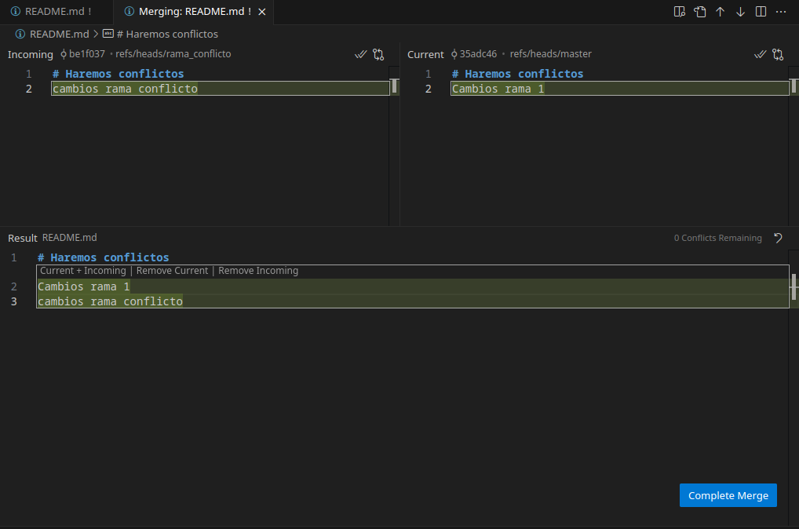

# Curso Git y GitHub

## Clase 1: Introducción a Git

### ¿Qué es un control de versiones?
Es un sistema que registra cada cambio que se realiza  
en el código fuente de tu proyecto.  
Esto permite tener un histórico de todos los cambios  
producidos en los ficheros.  
Básicamente, como un historial de todos los cambios que  
hiciste en tu código.  

### ¿Qué es Git?
Git es una herramienta de control de versiones diseñada por Linus Torvalds.

### ¿Qué es un repositorio?
Son el pilar de Git.  
Es una carpeta en la que se almacenan las diferentes versiones de los ficheros  
de un proyecto y también todas las versiones con los cambios que se realizaron.

### Iniciar un proyecto en Git
Existen 2 formas para crear un proyecto en Git.  
Si quieres crear un proyecto desde 0 (crear un repositorio local), puedes usar `git init` con el nombre del proyecto que quieras. Esto crea una carpeta vacía con el nombre del proyecto.  
* `git init <nombre_proyecto>`  
* `cd <nombre_proyecto>`

También puedes iniciar el proyecto desde una carpeta ya existente. Para hacerlo simplemente usas `git init` dentro de la raíz del directorio de tu proyecto.  
* `cd <directorio del proyecto>`  
* `git init`

Ambas formas sirven para poder crear un proyecto.
## Clase 2: States y Commits

### Los 3 estados de Git 
* **Modified:** El archivo fue creado, eliminado o tiene cambios que no fueron marcados como confirmados.

* **Staged:** El archivo ha sido marcado como preparado para ser confirmado en el repositorio local.

* **Committed:** El archivo se encuentra grabado en el repositorio local. Esta acción recibe el nombre de **commit**.

### Cómo cambiar el estado
Para saber el estado actual de nuestro repositorio usamos:
* `git status`

Esto nos avisará si algún archivo de nuestro repositorio recibió algún cambio.  

Si algún archivo fue modificado, nos aparecerá:


Ahora llevaremos el archivo `README.md` al estado **staged** con el siguiente comando:
* `git add README.md`

Ahora, si volvemos a ejecutar `git status`, nos aparecerá lo siguiente:


Confirmando que el archivo fue movido al stage.

### ¿Qué es un commit?
Es una de las piezas más fundamentales de Git.  

Sirven para registrar los cambios realizados en nuestro repositorio. Se podría decir que son como los *checkpoints* en los videojuegos: ya tendríamos un punto al cual volver si nos equivocamos.  
Estos puntos de guardado serían nuestros commits y van firmados con un autor, fecha, localización y otra información útil.

### ¿Cómo hago un commit?
Antes de realizar un commit, nuestros cambios ya deben estar en el estado **staged**.

Para realizar un **commit**, usamos el siguiente comando:
* `git commit`

En el caso de Linux, se nos abrirá lo siguiente en la terminal:


Otra manera de realizar el commit sin que se nos abra la terminal es usando el siguiente comando:
* `git commit -m "<nombre del commit>"`

De igual manera, el nombre del commit debe describir los cambios realizados en el repositorio.

Para revisar todos los commits hechos, puedes utilizar el comando:
* `git log`

### ¿Qué es el HEAD?
El **HEAD** es como una flecha que te indica "estás aquí". Solo puedes estar en un solo lugar, y ese lugar es el HEAD.  

Es el puntero que referencia el punto actual del historial de cambios del repositorio en el que estás trabajando.

### Ramas, merge y conflictos

### ¿Qué es una rama?
Una rama es una división del punto actual en el que nos encontramos en la rama principal.

### ¿Para qué sirven las ramas?
Nos sirven para hacer desarrollo no lineal y colaborativo, ya que, al poder hacer bifurcaciones de nuestro código, cada uno puede trabajar distintos aspectos de este.


Como vemos en la imagen, de la rama principal salen otras 2, que serían tu trabajo y el de tu amigo, por ejemplo. Cada uno trabaja aparte y se conectan al final.

### Creando nuestra primera rama
Para crear una rama usamos el siguiente comando:
* `git branch <nombre_de_nuestra_rama>`

Ahora, para ir a nuestra rama utilizamos el comando:
* `git switch <nombre_de_nuestra_rama>`

También existe un comando que nos permite crear la rama y llevarnos directamente a esta. El comando es:
* `git switch -c <nombre_de_nuestra_rama>`

Para poder crear una rama, mínimamente debemos tener un commit en el repositorio, lo cual tiene sentido, ya que ¿cómo se podría crear una rama de algo que no tiene ni tronco?
## Clase 3: Más de ramas

### Fusionar ramas
Las divisiones que creamos en forma de rama solo tienen dos destinos: acabar en el olvido o ser fusionadas en otra rama.

**¿Pero a qué nos referimos con fusión?**  
Cuando hablamos de fusión nos referimos a que los cambios en nuestra rama se integran con otra, de forma que el código que habíamos generado en la nueva rama se asimila en otra.

Para fusionar ramas empleamos el comando: 
* `git merge <nombre_rama_a_fusionar>`

Vemos que la fusión ocurre inmediatamente si solo se hicieron cambios en la rama a fusionar.  
Pero si realizamos cambios tanto en nuestra rama `main` como en la rama a fusionar, nos aparece una ventana indicando que se va a crear un commit de fusión.  
Esto sucede porque en el primer caso se hizo un **fast-forward**.

Cuando solo se hicieron cambios en la rama a fusionar, la salida será como se muestra en la siguiente imagen.


Cuando se hicieron cambios tanto en la rama main como en la rama que creamos, al momento de hacer el merge se nos abrirá lo siguiente en la terminal:


En mi caso, donde dice Merge branch "ramita", se indica el nombre que se le asignará al commit de fusión.

### ¿Qué es un fast-forward?
Cuando solo se hacen cambios en una rama, el primer commit de esta apunta directamente al último commit de la rama **main**, por así decirlo.  
Lo que hace el fast-forward es mover el puntero del último commit de la rama **main** al último commit de nuestra nueva rama, ya que, al no haber cambios en **main**, nuestro código no se dividió realmente, más allá de la rama que creamos.

### ¿Por qué no se crea el fast-forward cuando hacemos cambios en el main?
Se podría decir que, al momento de hacer cambios en nuestra rama **main**y en la otra rama, se forman dos caminos distintos desde el último commit antes de crear la rama.  
Entonces, para poder volver al camino principal, se necesita crear un commit que fusione el último commit de la rama con el último commit del otro camino generado desde **main**.

Ambos casos son una fusión. La única diferencia es que en uno se genera un commit explícito y en el otro no, ya que el fast-forward no necesita uno.

### Eliminar ramas ¿Por qué?
Porque es una buena práctica. Además, las ramas tienen un propósito específico, lo que implica un corto período de vida. Así mantenemos limpio nuestro repositorio.

Para eliminar ramas se utiliza el comando:
* `git branch --delete <nombre_rama_a_eliminar>`

O, para resumir:
* `git branch -d <nombre_rama_a_eliminar>`


En el caso de no haber fusionado la rama, nos aparecerá un mensaje de advertencia como el siguiente:


Si quisiéramos eliminar la rama sin importar si esta se fusionó o no, tenemos que utilizar el siguiente comando:
* `git branch -D <nombre_rama_a_eliminar>`

Este comando nos permite borrar la rama sin necesidad de que haya sido fusionada.


Y como podemos apreciar la rama se elimina sin advertirnos que no fue fusionada.

### Resumen de comandos para ramas
Para crear una nueva rama:
* `git branch <nombre_de_nuestra_rama>`

Para cambiar de rama se utiliza:
* `git switch <nombre_de_rama_a_la_que_queremos_cambiar>`
* `git checkout <nombre_de_rama_a_la_que_queremos_cambiar>`

Para ver todas las ramas que tenemos en nuestro repositorio local:
* `git branch`

Para ver todas las ramas, incluyendo las del repositorio remoto:
* `git branch -a`

Para fusionar ramas:
* `git merge <nombre_rama_a_fusionar>`

En caso de que se pueda hacer un fast-forward pero queramos evitarlo y crear un commit de fusión, se utiliza:
* `git merge <nombre_rama_a_fusionar> --no-ff`

Para eliminar ramas fusionadas:
* `git branch --delete <nombre_rama_a_eliminar>`
* `git branch -d <nombre_rama_a_eliminar>`

Para eliminar ramas no fusionadas:
* `git branch -D <nombre_rama_a_eliminar>`

### ¿Qué es un rebase?
El rebase toma los últimos 4 commits y los convierte en uno solo, quedándonos solo con la fusión de estos y eliminando los commits que fueron fusionados.

### Conflictos en Git
Digamos que en una rama realizamos cambios, pero en la de destino también realizamos cambios en las mismas líneas de un archivo y luego queremos unirlas. ¿Qué sucederá? En este caso, tendríamos un conflicto.

Básicamente, un conflicto es una situación en la que Git no es capaz de determinar qué cambio debe prevalecer una vez ocurrida la fusión y, por lo tanto, requiere que el usuario lo resuelva.


Al momento de que suceda un conflicto en la terminal, nos aparecerá lo siguiente:


### Resolviendo conflictos
Si estamos trabajando en Visual Studio, nos aparecerá lo siguiente:


Ahora tenemos tres opciones:

* Quedarnos con los cambios de la rama **main**


* Quedarnos con los cambios de nuestra otra rama


* Quedarnos con ambos cambios (rama **main** y nuestra rama)


## Clase 4: GitHub


### ¿Git y GitHub son lo mismo?
No, **Git** es un sistema de control de versiones. Por otro lado, **GitHub** es un servicio de alojamiento en la nube que utiliza Git para manejar repositorios.

### ¿GitHub es único?
No, existen otros servicios de alojamiento de código fuente como:
* Bitbucket  
* GitLab

### Repositorios remotos
Los repositorios remotos son repositorios que están hospedados en un servidor y sirven como punto de sincronización entre diferentes repositorios locales.

### Cómo crear un repositorio
Nos dirigimos a la sección de **repositorios** de nuestro perfil.  


Una vez en la sección de repositorios de nuestro perfil, presionamos el botón **New**.


Aquí podemos escoger el nombre de nuestro repositorio, agregar una descripción, elegir si será público o privado, y configurar otras opciones.


Finalmente, seleccionamos la opción **Create repository** al final.


Así de sencillo podemos crear un repositorio en GitHub.

### Enlazar un repositorio local con un repositorio remoto
Para enlazar un repositorio, utilizamos el siguiente comando:
* `git remote add origin <url_del_repositorio_GitHub>`
  * **origin** es el nombre de la sincronización de nuestro repositorio remoto con nuestro repositorio local. Por estándar, se usa el alias **origin**.

Para obtener la URL, simplemente copiamos esta parte:


Si nos estamos conectando a un repositorio ya existente, utilizamos el siguiente comando:
* `git clone <url_del_repositorio_GitHub>`

Lo que hace `git clone` es crear una copia del repositorio remoto en nuestro repositorio local, para así poder trabajar en él.

Para obtener la URL de un repositorio ya existente, la copiamos del siguiente lugar:


### Escribiendo en el repositorio remoto
Para poder subir cambios a nuestro repositorio remoto utilizamos el comando:

* `git push origin <rama_que_queremos_subir>`
  * Por lo general es la rama `main` o `master`, nuestra rama principal.

Con esto, nuestro repositorio remoto ya debería contener los archivos de la rama que subimos desde nuestro repositorio local.

Para observar nuestras ramas tanto del repositorio local como las ramas del repositorio remoto utilizamos el comando:
* `git branch -a`


Las ramas que están en color rojo son las ramas que ya están en el repositorio remoto.

Para subir una rama a nuestro repositorio remoto, esta primero debe estar en nuestro repositorio local. Si intentamos subir una rama que no existe localmente, nos saldrá lo siguiente:


### Eliminar ramas de mi repositorio local que ya no se usan
Digamos que una rama se eliminó del repositorio remoto, pero la referencia sigue apareciendo en tu repositorio local. Para eliminar esta referencia tienes que utilizar el siguiente comando:
* `git remote prune origin`

Esto básicamente actualiza las referencias de ramas que tiene tu repositorio local con las del repositorio remoto.

### Actualizar referencias de ramas en tu repositorio local
Así como podemos eliminar las referencias de una rama, también podemos actualizarlas y traer nuevas referencias de las ramas remotas. Esto se hace con el comando:
* `git fetch`

Es importante utilizar un `git fetch` antes de un **pull**, comando para traer cambios del repositorio remoto, ya que podríamos traer los cambios de otra rama a nuestra rama principal.

Para poder utilizar una rama de tu repositorio remoto en tu repositorio local, primero debes hacer un `switch` a la referencia de esa rama.

### Comandos útiles

Comando para sincronizar el repositorio local con el remoto:  
* `git remote add origin <url_del_repositorio_GitHub>`

Comando para mostrar el alias del URL al que apuntan:  
* `git remote -v`

Comando para eliminar referencias de ramas en tu repositorio local:  
* `git remote prune origin`

Comando para actualizar referencias de ramas en tu repositorio local:  
* `git fetch`

Comando para cambiar a una rama remota:  
* `git switch <rama_remota>`

Comando para clonar repositorios ya avanzados:  
* `git clone <url_del_repositorio_GitHub>`

Comando para subir nuestros cambios del repositorio local al repositorio remoto:  
* `git push origin <rama>`

### Push, pull y pull request

### ¿Cuál es la diferencia entre git push y git pull?
* **Git push**
    Nos sirve para empujar (subir) cualquier cambio o modificacion del repositorio local al repositorio remoto

* **Git pull**
    Nos sirve para jalar (traer) cambios del repositorio remoto al repositorio local.

### Comandos git push

Comando para subir nuestros cambios del repositorio local al repositorio remoto:  
* `git push origin <rama>`

Comando para subir todas las ramas con su referencia adecuada:  
* `git push --all`

Comando para subir varias ramas:  
* `git push origin <rama1> <rama2> <rama3>`

Comando para forzar la subida de cambios al repositorio remoto. Muy peligroso, ya que puede sobrescribir y eliminar cambios realizados previamente o por otras personas:  
* `git push -f <rama>`

Comando para eliminar ramas del repositorio remoto:  
* `git push -d origin <rama>`

Comando para enlazar el origin con la rama. Por lo tanto, ya no es necesario usar `git push origin <rama>`, solo necesitaríamos poner `git push`:  
* `git push -u origin <rama>`

### Comandos git pull

Comando para traer cambios del repositorio remoto al repositorio local:  
* `git pull origin <rama>`

Comando para unir la rama remota con la rama local y poder utilizar solo `git pull`:  
* `git pull --set-upstream origin <rama>`

Comando para traer todos los cambios de todas las ramas remotas al repositorio local:  
* `git pull --all`

Comando para traer todos los cambios de varias ramas remotas a la rama local:  
* `git pull origin <rama1> <rama2> <rama3>`

### ¿Qué es una Pull Request?
Tambien abreviada **PR**, es una peticion de cambios que se envia al repositorio original.

### ¿Comó se hace una Pull Request?
Tenemos que subir nuestra rama con `git push` y a continuación hay 2 maneras:
* Si subiste la rama recientemente te aparecera la opción en GitHub > Code.
* Irnos direcamente al apartado de Pull Request.


### Hacer una buena PR

* **Enfoca tu código en una sola cosa**  
  Es más fácil revisar y aceptar una Pull Request que hace una sola cosa, que revisar una Pull Request que hace muchas cosas.

* **Explica tu Pull Request**  
  Trata de ser lo más claro posible en la Pull Request. Además, puedes aprovechar para subir una imagen, video o incluso un GIF.

### Revisar una PR
* Proporciona siempre feedback positivo.

* Corrección y claridad. Sé específico acerca del problema que encuentras y haz que sea fácil para la otra persona corregir el error.

* **Entiende el contexto**, es posible que, a veces, tengamos que aplicar soluciones temporales o parches a nuestro código y que, pese a no ser el más bonito, sí cumpla su cometido.

## Clase 5: Flujos de trabajo

### ¿Qué es un GitFlow?
Es la manera en la que un equipo va a utilizar Git, a través de un cierto flujo para poder trabajar de manera colaborativa, siguiendo ciertas pautas que promueven un flujo u otro respecto a Git.

### Git Flow
Es el flujo de trabajo más antiguo, y utiliza más ramas:

* **main (o master):** Contiene el código de producción, es decir, el código que ya se está utilizando y es visible.
* **develop:** Código de preproducción, es decir, código que todavía debe ser probado y validado.
* **feature:** Nuevas características para el proyecto.
* **release:** Cambios de último momento antes de pasar a producción.
* **hotfix:** Parches o correcciones de errores menores.

### GitHub Flow
Tiene la rama **main** y cualquier otra rama que se quiera integrar por medio de una **Pull Request (PR).**

GitHub Flow es una alternativa más simple que Git Flow. Tiene menos liturgías, es más fácil de entender y favorece los despliegues continuos del proyecto.

### Git Flow o GitHub Flow
Depende de cada equipo y de la comodidad. Sin embargo, en cuanto a la seguridad al proteger la rama **main**, GitHub Flow ofrece más control, ya que necesariamente se debe revisar la **PR**, lo cual reduce la probabilidad de que aparezcan bugs.

### Trunk-Based Development
Bastante parecido a GitHub Flow. Utiliza solo la rama **main** y ramas auxiliares efímeras que son integradas mediante una **PR**.

La diferencia con GitHub Flow es que las ramas deben ser lo más efímeras y pequeñas posible.

Este método debe contar si o si con un sistema de **CI/CD** (Integración y Entrega Continuas).

### Ship / Show / Ask
Este método nos dice que los desarrolladores, ya en el ámbito laboral, pueden tomar decisiones coherentes y no son niños. Por ejemplo, en los dos métodos anteriores se les restringía el acceso a la rama main porque podían cometer errores.

* **Ship:** Tus cambios se fusionan con la rama principal sin revisión. Esto lo haces cuando estás 100% seguro de que tu cambio funciona bien.

* **Show:** Abres una petición de cambios para que sean revisados por CI y se fusionen inmediatamente. Es decir, si pasan el CI se fusionan, y además se abre una **PR** para debate. Esto se utiliza cuando estás un 80% seguro de que tu código funcione bien o si solo quieres que tu equipo tenga un contexto de lo que hiciste.

* **Ask:** Abres una **PR** para discutir los cambios antes de fusionarlos. Se utiliza cuando estás menos de un 10% seguro de que tu código o implementación funcione bien, así puedes recibir feedback y discutir los cambios.

### Las reglas de Ship / Show / Ask

* Tener un buen sistema de **CI/CD** ayuda un montón, pero no es obligatorio tenerlo.

* Confiamos en el equipo y existen buenas prácticas de desarrollo: pair programming, mob programming, seniority... y, sobre todo, existe responsabilidad. Las personas se responsabilizan de decidir la categoría de su cambio. **Un gran poder, como poder hacer merge de tus propias Pull Requests, conlleva una gran responsabilidad (no romper producción).**

* Las revisiones de código no son un requisito.

* Las ramas son lo más pequeñas posible, tienen un tiempo de vida corto y siempre salen directamente desde la rama principal.

* El equipo ha sabido lidiar con el ego individual, las personas confían en el resto del equipo y las pruebas automáticas pasan.

### Recomendación final

No necesariamente tienes que apegarte al 100% a un flujo de trabajo. Lo más importante es que tú y tu equipo se sientan cómodos. Si lo desean, pueden optar por tomar partes de distintos flujos de trabajo; mientras estén cómodos y el flujo funcione, todo sirve.

## Clase 6: Buenas prácticas en Git

### ¿Para qué sirven las buenas prácticas?

* Es un estándar manejado en la mayoría de los equipos de desarrollo.

* Resolver conflictos o problemas durante el desarrollo es más fácil.

* Tu historial de commits es más legible.

### ¿Cada cuánto debería hacer un commit?

Con frecuencia. Es mejor hacer commits pequeños, agrupando pequeñas mejoras o acciones, que un solo commit con todo lo que se quiera hacer.

Hacer commits a menudo no significa que debas hacer commits sin sentido.

### ¿Cómo escribir buenos commits?

* Usa el verbo en imperativo (Add, Change, Fix, Remove).

* No uses punto final ni puntos suspensivos en tus mensajes (a lo más, usa la coma).

* Usa como máximo 50 caracteres para tu mensaje de commit.

* Añade todo el contexto que sea necesario en el cuerpo del commit (con reglas de puntuación).

* Considera usar utilidades para hacer commits.

* Usa un prefijo para hacerlos más semánticos.


**Ejemplo de commit:**

`Add: se añadió la parte de ejemplo commit`

### Prefijos para commits

* **feat:** Para una nueva característica para el usuario.

* **fix:** Para un bug que afecta al usuario.

* **perf:** Para cambios que mejoran el rendimiento del sitio.

* **build** Para cambios en el sistema de build, tareas de dspliegue, o instalación.

* **ci:** Para cambios en la integración continua.

* **docs:** Para cambios en la documentación.

* **refactor:** Para refactorización del código como cambios de nombre de variables o funciones.

* **style:** Para cambios de formato, tabulaciones, espacios o puntos y coma, etc; no afectan al usuario

* **test:** Para tests o refactorización de uno ya existente.

#### Escribir un buen nombre de rama

* Sé consistente al nombrar tus ramas.
* Usa el nombre de la acción que se realiza en la rama.

  **Ejemplo**

  * experiment/probar_nuevo_diseño_ui
  * bug/erro_inicio_sesión

## Clase 7: Deshacer cambios

### ¿En qué casos deshacemos cambios?

* Cuando un proyecto dejó de funcionar.

* Queremos recuperar una parte del código que eliminamos.

* Queremos recuperar archivos que eliminamos.

### Comandos destructivos y no destructivos

Los comandos destructivos afectan el historial de commits realizados; un ejemplo es `rebase`.  
En cambio, los comandos no destructivos trabajan en base al historial sin modificarlo.

Principalmente se usan los siguientes tres:

  * **git reset**
  Posee 2 opciones:

    * **soft:** Mantiene los cambios que ocurrieron antes de hacer commit desde donde apuntaba.

      * `git reset --soft <ID_commit_a_borrar>`

      Básicamente solo elimina el commit, pero los cambios en nuestro Visual Studio antes de guardar el commit se mantienen, y también se mantiene el estado staged antes del commit.

    * **hard:** Descarta cambios.

      * `git reset --hard <ID_commit_a_borrar>`

      Elimina el commit, los cambios del editor de nuestro Visual Studio y también el estado staged.
    
    También se puede usar simplemente el comando `git reset <ID_commit_a_borrar>`, que es como una mezcla de los dos: elimina el commit y también el estado staged, pero no elimina los cambios de nuestro Visual Studio que estaban en el commit.

    Si después de borrar el commit volvemos a hacerlo, el mismo commit, el ID del commit cambia. Esto es bastante similar al comando `git commit --amend -m <nombre_commit>`, que sigue siendo el mismo commit pero con otro nombre e ID distinto.

* **git revert** 
  Revierte los cambios que un commit introdujo y crea un nuevo commit con los cambios revertidos.

  Es un comando no destructivo, ya que no borra commits y solo afecta al commit padre del commit al cual queremos volver. Se hace con el siguiente comando:

  * `git revert <ID_commit>`    

  ¿A qué nos referimos con que solo afecta al commit padre del commit al cual queremos volver?

  Por ejemplo, digamos que tenemos lo siguiente:


    ```bash
    $ git log --oneline

    974c381 (Head -> main) 3er hola
    2eddbea 2do hola
    b14efc1 1er hola

    ```

    Al momento de querer hacer revert al commit "2do hola" con el comando `git revert 2eddbea`, nos aparecerá un conflicto a resolver en Visual Studio y los cambios a los que se quiere volver no serán los del commit "2do hola", sino que serán del padre, es decir, del commit "1er hola".

  Para revertir el `revert`, simplemente utilizamos el comando `git revert --abort`, lo cual nos devuelve a nuestra situación anterior.

* **git checkout**
  Nos permite recuperar código específico de commits. Si bien el `git checkout` se utiliza para moverse entre ramas, este nos permite ver el contenido que tenían nuestros commits pasados.

  El comando para utilizarlo es:

  * `git checkout <ID_commit>`

  Esto nos abrirá una ventana en Visual Studio donde nos muestra el estado de nuestro código en el commit seleccionado.

  Para volver al **main**, utilizamos el comando:

  `* git checkout main`

## Comandos extra
Para ver los cambios que hicimos en un commit, podemos utilizar el comando:

* `git show <ID_commit>`

Ahí nos mostrará los cambios que se hicieron en ese commit.

Digamos que, por x o y motivo, borramos todos nuestros cambios y commits. Con el siguiente comando podemos verlos de nuevo:

* `git reflog`

Hacemos un `git revert <ID_commit_antes_de_borrar_todo>` y otra vez nos volverán a aparecer todos nuestros commits.

Otra manera de volver a traer los commits es con el comando:

* `git pull origin main`

Esto solo funcionará si nuestros commits ya fueron guardados en la nube.

## Comandos para deshacer cambios

* `git reset --hard HEAD ~<N>`

* `git reset --soft HEAD ~<N>`

* `git revert HEAD ~<N>`

* `git checkout HEAD ~<N>`

  Se pone el **HEAD~<N>** porque es cuántos espacios recorremos hacia abajo a partir del HEAD.

* `git reset --hard <SHA>`

* `git reset --soft <SHA>`

* `git revert <SHA>`

* `git checkout <SHA>`

  **SHA** viene siendo el ID del commit.